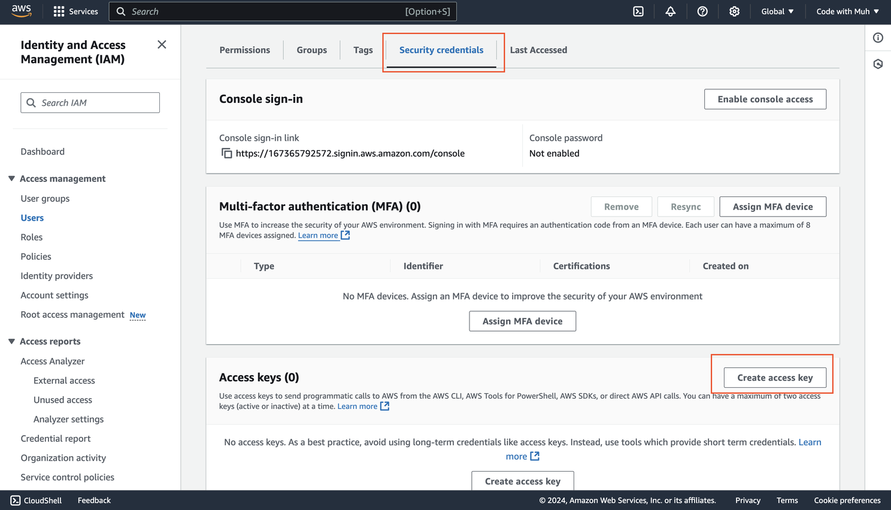
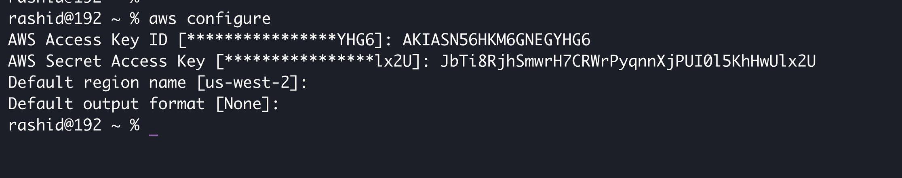
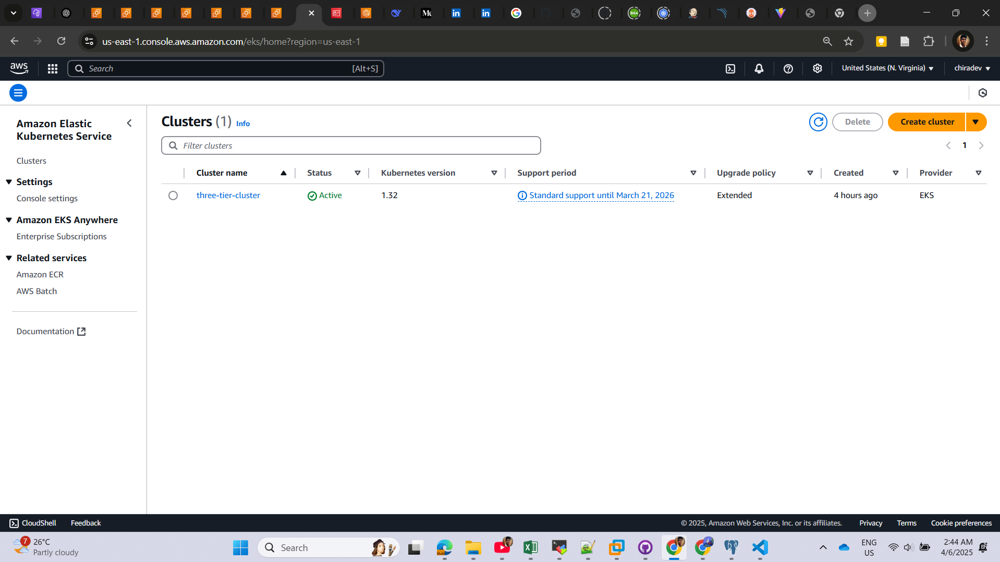

# three-tier-devsecops

# 🚀 DevSecOps E2E Deployment on AWS EKS with GitOps, Jenkins, Trivy, ArgoCD, Prometheus, and Terraform

This project is a **complete DevSecOps implementation** showcasing how to build, scan, monitor, and deploy a production-grade **three-tier web application** on **AWS EKS**, with full automation using **Jenkins**, **Terraform**, **ArgoCD**, **Prometheus**, **Grafana**, **Trivy**, and **SonarQube**.

---

## 📌 Table of Contents

- [📌 Table of Contents](#-table-of-contents)
- [🎯 Project Overview](#-project-overview)
- [🧰 Tools & Technologies Used](#-tools--technologies-used)
- [📐 Architecture](#-architecture)
- [⚙️ Infrastructure Setup (IaC)](#️-infrastructure-setup-iac)
- [🔁 CI/CD Pipeline Overview](#-cicd-pipeline-overview)
- [🔐 Security Integration](#-security-integration)
- [📊 Monitoring & Observability](#-monitoring--observability)
- [📦 AWS Services Used](#-aws-services-used)
- [🛠️ Prerequisites](#️-prerequisites)
- [🚀 How to Use](#-how-to-use)
- [🧪 Testing](#-testing)
- [📽️ Demo](#️-demo)
- [📄 License](#-license)

---

## 🎯 Project Overview

This guide demonstrates how to deploy a secure, scalable, and fully monitored web application using modern DevSecOps practices. The solution is built on a **three-tier architecture** (frontend, backend, and database), running on **Amazon EKS** with **GitOps**-powered deployments and comprehensive CI/CD pipelines.

---

## 🧰 Tools & Technologies Used

| Category          | Tools & Services                                 |
| ----------------- | ------------------------------------------------ |
| CI/CD             | Jenkins                                          |
| Containerization  | Docker, Amazon ECR                               |
| IaC               | Terraform                                        |
| GitOps            | ArgoCD                                           |
| Monitoring        | Prometheus, Grafana                              |
| Security Scanning | Trivy (Image scanning), SonarQube (Code Quality) |
| Cloud             | AWS (EKS, S3, EC2, DynamoDB, IAM)                |

---

---

## AWS Infrastructure Setup

### IAM User Setup

- Create an IAM user with permissions for **EKS, S3, DynamoDB, ECR, and EC2**.

### Terraform & AWS CLI Installation

- Install **Terraform** and **AWS CLI** locally.
- Configure AWS CLI with IAM credentials using `aws configure`.

### S3 Bucket and DynamoDB Table

- Use Terraform to create:
  - **S3 bucket** for storing Terraform state files.
  - **DynamoDB table** for state locking.

---

## Jenkins Server Configuration

### Infrastructure as Code (IaC)

- Deploy a Jenkins server on an **EC2 instance** using Terraform.

### Jenkins Software Installation

- Use a shell script with Terraform `user_data` to install:
  - Jenkins, Docker, Docker Compose, Terraform, Kubectl, AWS CLI, Trivy, and SonarQube.

### Plugin Installation

- Install Jenkins plugins:
  - AWS Credentials, AWS Steps, Docker, Eclipse Temurin, NodeJS, OWASP Dependency-Check, and SonarQube Scanner.

### SonarQube Integration

- Configure SonarQube for code quality analysis in Jenkins pipelines.

---

### EKS Cluster Deployment

- Deploy an **EKS cluster** using Terraform, including:
  - VPC, subnets, security groups, and IAM roles.
  - Managed node groups for worker nodes.

---

### Monitoring with Prometheus & Grafana

- Install **Prometheus** and **Grafana** on EKS using Helm.
- Set up dashboards in Grafana for cluster and application monitoring.

---

## CI/CD Pipelines

### Amazon ECR Repositories

- Create ECR repositories for **frontend** and **backend** Docker images.
- Configure Jenkins to push images to ECR after scanning with Trivy.

### Pipeline Stages

- **Frontend Pipeline**:
  - Build, test, SonarQube scan, Dockerize, push to ECR, and deploy to EKS.
- **Backend Pipeline**:
  - Similar stages with dependency checks and security scans.

---

### GitOps with ArgoCD

- Install **ArgoCD** on the EKS cluster.
- Configure ArgoCD to auto-deploy applications from a Git repository.

---

### DNS Configuration

- Point a subdomain (e.g., `app.example.com`) to the EKS load balancer/Ingress using **Cloudflare**.

---

### Data Persistence

- Configure **Persistent Volumes (PV)** and **Persistent Volume Claims (PVC)** for database pods (e.g., Redis, PostgreSQL).

---

### Validation & Production Readiness

- Test end-to-end deployment.
- Validate integrations (SonarQube, ArgoCD, monitoring).
- Ensure scaling policies and alerts are configured.

## IAM User Setup

Create IAM User

- On AWS Console, search **IAM**, and click **Users**.
- Click **User**.
  
- Next, click Create User
  

- Give a username
  

Set Permissions

- Attach **administrative access** for testing.
- For your company project, assign **limited policies**.


Create Access Key

- Click **Security Credentials**, and click on **Create access key**.



- Choose **Command Line Interface (CLI)**.


- Download the file for later use of the **secret key** and **access key**.


We have done now with IAM user creation

Okay, I understand. Here's the information you requested:

**2. Terraform & AWS CLI Installation**

To install Terraform, You can visit the official Terraform website.

To install AWS CLI, You can visit the AWS installation page.

After installation, you can verify the installation with these two commands:

```bash
terraform --version
aws --version
```

Then configure the AWS CLI using the given command below. Use the Access Key and Secret Key from the CSV file you downloaded in the IAM User step.

```bash
aws configure
```


**3. S3 Bucket and DynamoDB Table**

As an S3 Bucket and DynamoDB are required for Terraform's backend state, you can create them by watching my video.

The S3 bucket can be any name, just ensure it's a unique name.

The DynamoDB table name will be `lock-files`, and the partition key will be `LockID`.


Okay, I understand. Here's the information from steps 4, 5, and 6 of your guide:

**4. Jenkins EC2 Server Setup with Terraform**

1.  **Clone the git repo:**
    ```bash
    git clone https://github.com/codewithmuh/three-tier-devsecops-project.git
    ```
2.  **Go to the Jenkins server Terraform folder:**
    ```bash
    cd three-tier-devsecops-project/jenkins-server-terraform
    ```
3.  **Update backend configuration:** Make sure to edit the `backend.tf` file and update the names of your S3 bucket and DynamoDB table.
4.  **Create a .pem file for SSH:**
    ```bash
    aws ec2 create-key-pair --key-name devsecops-project --query "KeyMaterial" --output text > devsecops-project.pem
    ```
5.  **Run Terraform commands:**
    ```bash
    terraform init
    terraform validate
    terraform apply
    ```
6.  **SSH to your Jenkins server:**
    - Navigate to the directory where your `devsecops-project.pem` file is located.
    - Set the correct permissions for the private key:
      ```bash
      chmod 400 "devsecops-project.pem"
      ```
    - SSH into the server using its public IP address (replace `35.92.246.29` with your server's actual IP):
      ```bash
      ssh -i "devsecops-project.pem" ubuntu@35.92.246.29
      ```
7.  **Configure AWS CLI on the Jenkins server:** Once you are SSH'd into the EC2 instance, configure the AWS CLI as you did on your local machine:
    ```bash
    aws configure
    ```

**5. Installing Plugins on Jenkins**

1.  **Open Jenkins in your browser:** Access Jenkins using your EC2 instance's public IP address and port 8080 (e.g., `http://<EC2-IP>:8080`).
2.  **Get the initial admin password:** On your Jenkins EC2 instance, run the following command to retrieve the initial administrator password:
    ```bash
    sudo cat /var/lib/jenkins/secrets/initialAdminPassword
    ```
3.  **Install recommended plugins:** Follow the Jenkins setup wizard and choose to install the recommended plugins.
4.  **Install additional plugins:** After creating your Jenkins account, navigate to **Manage Jenkins** -> **Plugins** -> **Available plugins** and install the following plugins:
    - AWS Credentials
    - AWS Steps
    - Docker plugins
    - Eclipse Temurin installer
    - NodeJS
    - OWASP Dependency-Check
    - SonarQube Scanner

**6. SonarQube Setup:**

1.  **Open SonarQube in your browser:** Access SonarQube using your Jenkins server's public IP address and port 9000 (e.g., `http://<jenkins-server-public-ip>:9000`).
2.  **Default credentials:** The default username and password for SonarQube are both `admin`.
3.  **Perform SonarQube setup steps:** You need to perform the following five steps within the SonarQube setup (refer to the "sonarqube setup" video for detailed instructions):
    - Setup of the frontend project for code analysis.
    - Setup of the backend project for code analysis.
    - Replace the keys in the `jenkins-pipeline` folder with the keys obtained from the frontend and backend project setup in SonarQube.
    - Create a sonar-token within SonarQube and save it for later use in Jenkins.
    - Create a webhook in the SonarQube dashboard with the following URL: `http://<jenkins-ec2-server-public-ip>:8080/sonarqube-webhook/`

Okay, here's the information from steps 7 through 10 of your guide:

**7. Amazon ECR Repositories**

Create two repositories in Amazon ECR (Elastic Container Registry): one for your backend application and one for your frontend application.

Log in to the ECR registry on your Jenkins server using the `aws ecr get-login-password --region <your-aws-region> | docker login --username AWS --password-stdin <your-aws-account-id>.dkr.ecr.<your-aws-region>.amazonaws.com` command (replace `<your-aws-region>` and `<your-aws-account-id>` with your actual AWS region and account ID).


**7a. Add Credentials in Jenkins**

Navigate to **Manage Jenkins** -> **Credentials**. You need to add a total of 7 credentials:

- **aws-key:** An AWS access key ID and secret access key (Kind: AWS Credentials).
- **GITHUB:** Your GitHub username and password (Kind: Username with password).
- **github:** Your GitHub personal access token (Kind: Secret text).
- **sonar-token:** The SonarQube token you created (Kind: Secret text).
- **ECR_REPO_FRONTEND:** The URL of your frontend ECR repository (e.g., `<your-aws-account-id>.dkr.ecr.<your-aws-region>.amazonaws.com/<your-frontend-repo-name>`) (Kind: Secret text).
- **ECR_REPO_BACKEND:** The URL of your backend ECR repository (e.g., `<your-aws-account-id>.dkr.ecr.<your-aws-region>.amazonaws.com/<your-backend-repo-name>`) (Kind: Secret text).
- **ACCOUNT_ID:** Your AWS account ID (Kind: Secret text).

**Configure Installed Plugins (Important)**

Go to **Dashboard** -> **Manage Jenkins** -> **System**.

- **SonarQube installations:**
  - Provide a **Name** (as is).
  - In the **Server URL**, copy your SonarQube public IP (same as Jenkins) with port 9000 (e.g., `http://<your-jenkins-ip>:9000`).
  - Select the **sonar-token** credential you added.
  - Click **Apply** and **Save**.
- **Tools:** Configure the following tools:
  - **JDK**
  - **sonar-scanner**
  - **nodejs**
  - **DP-Check**
  - **docker**

**8. EKS Cluster Deployment**

1.  **Create the EKS cluster:**
    ```bash
    eksctl create cluster --name three-tier-k8s-eks-cluster --region us-west-2 --node-type t2.medium --nodes-min 2 --nodes-max 2
    ```
2.  **Validate nodes:** Once the cluster is ready, check if the nodes are in the `Ready` state:
    ```bash
    kubectl get nodes
    ```
3.  **Configure Load Balancer prerequisites:**
    - **Download IAM policy:**
      ```bash
      curl -O https://raw.githubusercontent.com/kubernetes-sigs/aws-load-balancer-controller/v2.5.4/docs/install/iam_policy.json
      ```
    - **Create IAM policy:**
      ```bash
      aws iam create-policy --policy-name AWSLoadBalancerControllerIAMPolicy --policy-document file://iam_policy.json
      ```
    - **Create OIDC Provider:**
      ```bash
      eksctl utils associate-iam-oidc-provider --region=us-west-2 --cluster=three-tier-k8s-eks-cluster --approve
      ```
    - **Create Service Account (replace `<your-account-id>`):**
      ```bash
      eksctl create iamserviceaccount --cluster=three-tier-k8s-eks-cluster --namespace=kube-system --name=aws-load-balancer-controller --role-name AmazonEKSLoadBalancerControllerRole --attach-policy-arn=arn:aws:iam::<your-account-id>:policy/AWSLoadBalancerControllerIAMPolicy --approve --region=us-west-2
      ```
4.  **Deploy AWS Load Balancer Controller:**
    ```bash
    helm repo add eks https://aws.github.io/eks-charts
    helm repo update eks
    helm install aws-load-balancer-controller eks/aws-load-balancer-controller -n kube-system --set clusterName=three-tier-k8s-eks-cluster --set serviceAccount.create=false --set serviceAccount.name=aws-load-balancer-controller
    ```
5.  **Verify Load Balancer Controller pods:** After a few minutes, check if the controller pods are running:
    ```bash
    kubectl get deployment -n kube-system aws-load-balancer-controller
    ```

**9. Prometheus and Grafana Installation and Configuration**

**What is Grafana?**
Grafana is an open-source platform for visualization and analytics. It allows you to query, visualize, alert on, and explore metrics from various data sources.

**Steps to Install and Configure Prometheus and Grafana on Kubernetes**

1.  **Add Helm Repositories:**
    ```bash
    helm repo add stable https://charts.helm.sh/stable
    helm repo add prometheus-community https://prometheus-community.github.io/helm-charts
    ```
2.  **Create a Namespace for monitoring:**
    ```bash
    kubectl create namespace monitoring
    ```
3.  **Install Prometheus with Grafana using Helm:**
    ```bash
    helm install stable prometheus-community/kube-prometheus-stack -n monitoring
    ```
4.  **Verify Prometheus Installation:**
    ```bash
    kubectl get pods -n monitoring
    kubectl get svc -n monitoring
    ```
5.  **Expose Prometheus and Grafana to External Access:**
    - **Exposing Prometheus via LoadBalancer:**
      ```bash
      kubectl edit svc stable-kube-prometheus-sta-prometheus -n monitoring
      ```
      Change `type: ClusterIP` to `type: LoadBalancer` and save the file.
    - **Exposing Grafana via LoadBalancer:**
      ```bash
      kubectl edit svc stable-grafana -n monitoring
      ```
      Change `type: ClusterIP` to `type: LoadBalancer` and save the changes.
6.  **Accessing Grafana:**
    - Get the Load Balancer IP for the Grafana service:
      ```bash
      kubectl get svc -n monitoring stable-grafana -o jsonpath='{.status.loadBalancer.ingress[0].hostname}'
      ```
    - Open the obtained IP address in your browser.
    - The default username is `admin` and the password is `prom-operator`.
7.  **Configure the Grafana dashboard with Prometheus as explained in the video.**

**9. Jenkins Pipelines (Frontend & Backend)**

This step does not include any commands; please refer to the video for instructions on setting up the Jenkins pipelines for your frontend and backend applications.

**10. ArgoCD Installation & Application Deployment**

1.  **Create the ArgoCD namespace:**
    ```bash
    kubectl create namespace three-tier
    ```
2.  **Create ECR registry secret:** Replace `<your-aws-account-id>` and `<your-aws-region>` if needed.
    ```bash
    kubectl create secret generic ecr-registry-secret \
      --from-file=.dockerconfigjson=${HOME}/.docker/config.json \
      --type=kubernetes.io/dockerconfigjson --namespace three-tier
    ```
3.  **Verify the secret:**
    ```bash
    kubectl get secrets -n three-tier
    ```
4.  **Create the ArgoCD namespace:**
    ```bash
    kubectl create namespace argocd
    ```
5.  **Apply ArgoCD installation manifests:**
    ```bash
    kubectl apply -n argocd -f https://raw.githubusercontent.com/argoproj/argo-cd/v2.4.7/manifests/install.yaml
    ```
6.  **Verify ArgoCD pods:** Ensure all pods in the `argocd` namespace are running:
    ```bash
    kubectl get pods -n argocd
    ```
7.  **Expose the ArgoCD server as a LoadBalancer:**
    ```bash
    kubectl patch svc argocd-server -n argocd -p '{"spec": {"type": "LoadBalancer"}}'
    ```
8.  **Get the ArgoCD server LoadBalancer DNS and initial password:**
    ```bash
    sudo apt install jq -y
    export ARGOCD_SERVER=$(kubectl get svc argocd-server -n argocd -o json | jq -r '.status.loadBalancer.ingress[0].hostname') && export ARGO_PWD=$(kubectl -n argocd get secret argocd-initial-admin-secret -o jsonpath="{.data.password}" | base64 -d) && echo "ARGOCD_SERVER: $ARGOCD_SERVER" && echo "ARGO_PWD: $ARGO_PWD"
    ```
9.  **Access ArgoCD:** Open the `ARGOCD_SERVER` URL in your browser. Use `admin` as the username and the value of `ARGO_PWD` as the password.
10. **Configure Private Repository:** Follow the ArgoCD documentation to configure access to your private Git repository.
11. **Set up ArgoCD Applications:** Create ArgoCD applications for:
    - database
    - backend
    - frontend
    - ingress

### Project Implementation

<table>
  <tr>
    <td></td>
    <td></td>
    <td></td>
    <td></td>
  </tr>
  <tr>
    <td></td>
    <td></td>
    <td></td>
    <td></td>
  </tr>
  <tr>
    <td></td>
    <td></td>
    <td></td>
    <td></td>
  </tr>
  <tr>
    <td></td>
    <td></td>
    <td></td>
    <td></td>
  </tr>
</table>

Okay, I understand. Here's the information on cleaning up all the resources created during this project:

**Extra: Clean up Everything (To Avoid AWS Costs)**

**1. Delete the EKS Cluster:**

- **On your Jenkins server**, run the following command to delete your EKS cluster:

  ```bash
  eksctl delete cluster --name three-tier-k8s-eks-cluster --region us-west-2 --wait --timeout 30m
  ```

- **Important Note on Load Balancers:** If you encounter errors during cluster deletion related to load balancers, you will need to **manually delete the frontend and backend load balancers first** using the AWS Management Console or the AWS CLI. You can use ChatGPT or the AWS documentation to learn how to identify and delete these load balancers. After deleting the load balancers, retry the cluster deletion command above.

**2. Destroy Terraform Infrastructure (Local Machine):**

- **On your local machine**, navigate to the `jenkins-server-terraform` directory in your terminal.
- Run the following command to destroy the infrastructure managed by Terraform:

  ```bash
  terraform destroy
  ```

  Terraform will then go through the process of deleting the EC2 instance (your Jenkins server), the key pair, and any other resources defined in your Terraform configuration within that directory. You will likely be prompted to confirm the destruction plan before it proceeds.

**3. Delete Remaining AWS Resources (Local Machine or AWS Console):**

- **S3 Bucket:** Delete the S3 bucket you created for Terraform's backend state. You can do this using the AWS Management Console or the AWS CLI. **Be absolutely sure this is the correct bucket before deleting it.**
- **DynamoDB Table:** Delete the DynamoDB table named `lock-files` that you created for Terraform state locking. You can do this using the AWS Management Console or the AWS CLI.
- **IAM User:** Delete the IAM user you created for this project. Ensure you have removed any policies attached to this user before deleting it. You can manage IAM users in the AWS Management Console under the IAM service.

**4. Delete GitHub Personal Access Token:**

- **On GitHub**, navigate to **Settings** -> **Developer settings** -> **Personal access tokens**.
- Identify the token you created for this project and **revoke** or **delete** it.

By following these steps, you should be able to clean up all the AWS resources and the GitHub token associated with this project, helping you avoid unnecessary costs. Remember to be careful when deleting resources, especially S3 buckets and DynamoDB tables, as data stored in them might be permanently lost.
